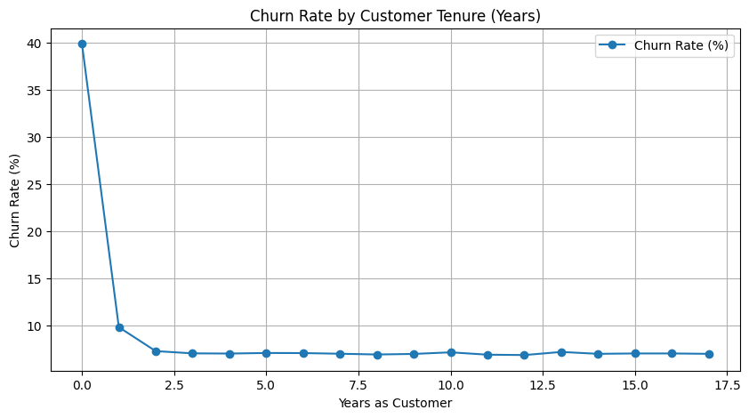
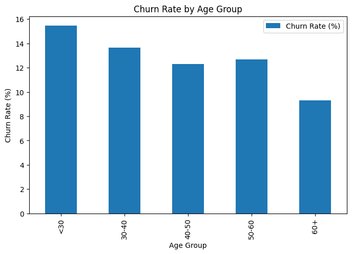
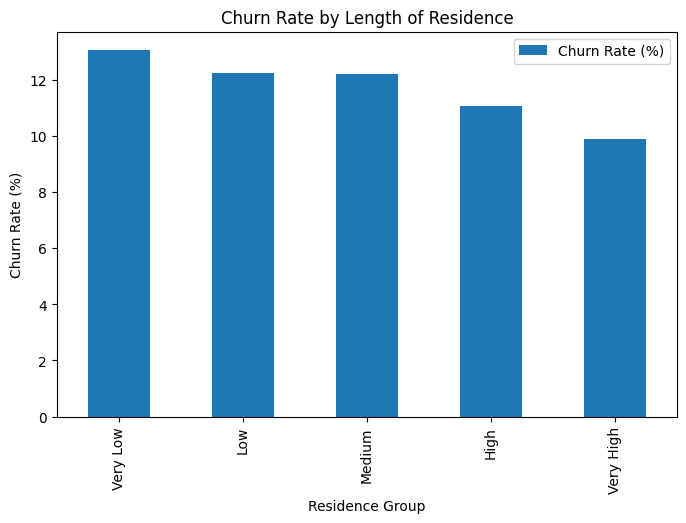
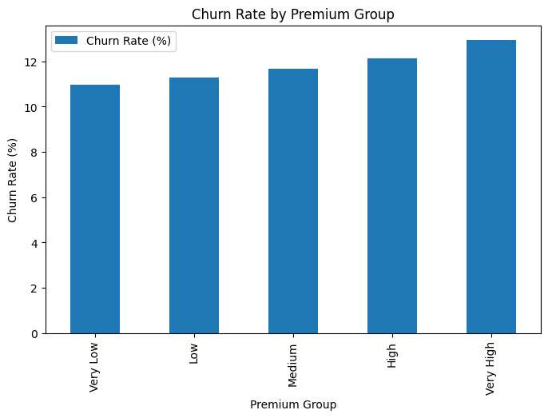

# Analyse der Kundenabwanderung in der Kfz-Versicherung

## Inhaltsverzeichnis

1. [Projektübersicht](#projektübersicht)
2. [Vorgehensweise](#vorgehensweise)
3. [Wichtigste Ergebnisse der explorativen Datenanalyse (EDA)](#wichtigste-ergebnisse-der-explorativen-datenanalyse-eda)
4. [Visualisierungen](#visualisierungen)
5. [SQL-Analyse und Kundensegmentierung](#sql-analyse-und-kundensegmentierung)
6. [Externe Datenbeschaffung mittels Web Scraping](#externe-datenbeschaffung-mittels-web-scraping)
7. [Handlungsempfehlungen](#handlungsempfehlungen)
8. [Weitere Analyseschritte](#weitere-analyseschritte)
9. [Verwendete Tools & Technologien](#verwendete-tools--technologien)
10. [Datenquelle](#datenquelle)

## Projektübersicht

In diesem Projekt wird die Kundenabwanderung eines Kfz-Versicherungsdatensatzes analysiert. Ziel ist es, Merkmale und Kundensegmente zu identifizieren, die mit erhöhten Kündigungsraten in Zusammenhang stehen, und daraus konkrete Handlungsempfehlungen zur Verbesserung der Kundenbindung abzuleiten.

## Vorgehensweise

1. Datenimport & Datenverständnis
2. Datenaufbereitung & Datenbereinigung
3. Feature Engineering
4. Explorative Datenanalyse (EDA)
5. SQL-Analyse & Kundensegmentierung
6. Externe Datenbeschaffung
7. Business-Empfehlungen

## Wichtigste Ergebnisse der explorativen Datenanalyse (EDA)

- **Vertragsdauer:** Die Vertragsdauer zeigt den stärksten Zusammenhang mit der Kundenabwanderung. Besonders Kunden mit sehr kurzer Vertragsdauer weisen eine deutlich erhöhte Kündigungsrate auf.
- **Alter:** Jüngere Kunden kündigen häufiger als ältere Kunden. Die niedrigste Kündigungsrate zeigt die Gruppe der Kunden ab 60 Jahren.
- **Wohndauer:** Mit zunehmender Wohndauer sinkt die Kündigungsrate.
- **Jahresprämie:** Höhere Versicherungsprämien gehen mit einer moderat höheren Kündigungsrate einher.
- **Weitere Merkmale:** Einkommen, Familienstand, Wohneigentum, Kreditwürdigkeit und Kinder zeigen in der Analyse keinen bzw. nur einen geringen Zusammenhang mit der Kündigungsrate.

## Visualisierungen

### Kündigungsrate nach Vertragsdauer

Die Kündigungsrate liegt im ersten Vertragsjahr bei **39,94 %**, fällt nach einem Jahr auf **10,57 %** und liegt ab dem zweiten Vertragsjahr überwiegend bei etwa **7 %**.

### Kündigungsrate nach Altersgruppe

Kunden unter 30 Jahren weisen mit **16,92 %** die höchste Kündigungsrate auf. Bei Kunden ab 60 Jahren liegt sie mit **9,24 %** am niedrigsten.

### Kündigungsrate nach Wohndauer

Die Kündigungsrate sinkt mit zunehmender Wohndauer von **13,39 %** in der Gruppe mit der kürzesten Wohndauer auf **9,91 %** in der Gruppe mit der längsten Wohndauer.

### Kündigungsrate nach Jahresprämie

Die Kündigungsrate steigt mit zunehmender Jahresprämie von **10,89 %** in der niedrigsten Prämiengruppe auf **12,83 %** in der höchsten Prämiengruppe.

## SQL-Analyse und Kundensegmentierung

Mit SQL wurden mehrere Kundenmerkmale kombiniert, um besonders relevante Risiko- und Kundensegmente zu identifizieren.

- **Alter & Vertragsdauer:** Die höchste Kündigungsrate zeigt die Kombination aus **40–50 Jahren und 0–2 Jahren Vertragsdauer mit 42,36 %**.
- **Alter & Jahresprämie:** Bei Kunden unter 30 Jahren mit niedriger Jahresprämie liegt die Kündigungsrate bei **18,78 %**. Ein eindeutiger Zusammenhang zwischen Prämienhöhe und Kündigungsrate zeigt sich innerhalb dieser Segmentierung nicht.
- **Alter & Wohndauer:** Die niedrigste Kündigungsrate weisen Kunden ab 60 Jahren mit sehr langer Wohndauer auf: **8,10 %**.
- **Risikosegmente:** Alle zehn Kundensegmente mit den höchsten Kündigungsraten haben eine Vertragsdauer von **0–2 Jahren**. Die höchste Kündigungsrate erreicht die Kombination **40–50 Jahre, sehr niedriges Einkommen und kurze Wohndauer mit 57,84 %**.

## Externe Datenbeschaffung mittels Web Scraping

Zur Erweiterung der Analyse wurden externe Inflationsdaten des Statistischen Bundesamtes direkt aus einer HTML-Tabelle mit `pandas.read_html()` eingelesen und für die weitere Analyse aufbereitet.

## Handlungsempfehlungen

Retention-Maßnahmen sollten sich insbesondere auf Kunden in den ersten beiden Vertragsjahren konzentrieren. Für eine gezieltere Priorisierung können zusätzlich Alter, Wohndauer und Jahresprämie auf Grundlage der SQL-Segmentierung berücksichtigt werden.

## Weitere Analyseschritte

Um die Ursachen der erhöhten Kündigungsrate in den ersten Vertragsjahren genauer zu untersuchen, könnten zusätzliche Daten einbezogen werden:

- **Schadensfälle:** Untersuchung, ob Kunden nach einem Schadensfall häufiger kündigen.
- **Abgelehnte Schadensfälle:** Analyse, ob die Ablehnung eines Schadensfalls mit einer erhöhten Kündigungswahrscheinlichkeit zusammenhängt.
- **Kundenservicekontakte:** Untersuchung, ob Anzahl, Anlass oder Ergebnis von Servicekontakten mit Kündigungen zusammenhängen.
- **Prämienänderungen:** Analyse, ob starke Beitragserhöhungen vor einer Kündigung auftreten.
- **Beschwerden:** Untersuchung, ob Beschwerden oder ungelöste Probleme Kündigungen vorausgehen.

## Verwendete Tools & Technologien

- Python
- Pandas
- NumPy
- Matplotlib
- SQL
- SQLite
- Google Colab
- GitHub

## Datenquelle

Der für die Kundenabwanderungsanalyse verwendete Datensatz stammt von Kaggle:

**Auto Insurance Churn Analysis Dataset**  
Merishna Singh Suwal  
https://www.kaggle.com/datasets/merishnasuwal/auto-insurance-churn-analysis-dataset

Für die Analyse werden folgende Dateien aus dem Datensatz verwendet:

- `customer.csv`
- `demographic.csv`
- `termination.csv`

Aufgrund der Dateigröße werden die CSV-Dateien nicht direkt im GitHub-Repository bereitgestellt. Sie können über den oben verlinkten Kaggle-Datensatz heruntergeladen werden.
